[](https://github.com/azoght/cpsc_210_project/actions/workflows/maven.yml)
# Easy Budget!

## Proposal

This **Easy Budget** project is a simplified version of a budgeting application. The goal of this project is to make 
available to individuals a budgeting tool that is not only user-friendly but also intuitive, with the end goal of 
making it easier to manage personal finances. Inspired by [***Intuit Mint***](https://mint.com), one of the most widely 
used applications for personal finance management, my objective is to create a streamlined version of the software that 
keeps the essential features but provides a user experience that is less complicated and more readily available. The 
application has an intuitive user interface for keeping track of monthly costs for expenses like groceries, books, 
transportation, etc. Additionally, it enables users to create monthly budgets using pre-established spending categories 
like insurance, food, and education, among others, and monitor their progress month after month. Users will be able to 
view their budget and expenditures, as well as make adjustments accordingly based on the planned budget.

Post-secondary students and anyone else seeking financial independence are the target demographic. By providing
a user-friendly budgeting tool, this program aims to provide users with the knowledge and skills needed to make
informed financial decisions. As a university student working towards a career, I am interested in this
project because I believe that creating a budget is necessary in order to achieve a level of financial independence.
The application's primary focus corresponds with the goals that I have for my own money management. My aim with
**Easy Budget** is to make a positive impact on people's financial lives by giving them the right tool to take
the steps necessary to build a financially stable future for themselves and their families.

## User Stories

- As a user, I want to be able to create a monthly budget with a total spending limit
- As a user, I want to be able to add expense categories with limits to the monthly budget
- As a user, I want to be able to view the expense categories in my budget, along with their limits
- As a user, I want to be able to edit the limits of the expense categories in the budget
- As a user, I want to be able to delete one or more expense categories from the budget
- As a user, I want to be able to add an expense with an amount, description, vendor,
  date, and expense category
- As a user, I want to be able to edit all the details of a given expense 
- As a user, I want to be able to delete one or more expenses from my expense tracker
- As a user, I want to be able to view my expenses for a given time interval and selected categories
- As a user, I want to be able to see if my expenses in each category went over or under budget for the last month
- As a user, I want to be able to save both my budget and expense tracker to file once I quit the application (if I so 
  choose)
- As a user, I want to be able to reload both my budget and expense tracker from file once I start the application (if I
  so choose)

## Getting Started
Before you run the program, make sure you have Java and Maven installed.

To install Maven, follow these steps:

1. **Check for Java Installation:** Maven is a Java-based tool, so you'll need Java installed on your system. Open your terminal or command prompt and run the following command to check if Java is already installed:

   ```bash
   java -version
   ```

   If you see Java's version information, it means Java is already installed. If not, you'll need to [download and install Java](https://www.oracle.com/java/technologies/javase-downloads.html) first.

2. **Download Apache Maven:**

   Visit the [official Apache Maven download page](https://maven.apache.org/download.cgi) and download the latest binary zip archive of Maven. Choose the version that fits your operating system.

3. **Extract Maven:**

   Once the download is complete, extract the Maven archive to a directory on your system. For example, on Unix-based systems, you can use the following command:

   ```bash
   tar -xzvf apache-maven-{version}-bin.tar.gz
   ```

   On Windows, you can use a tool like [7-Zip](https://www.7-zip.org/) to extract the archive.

4. **Set Environment Variables (Optional):**

   To use Maven from the command line globally, you can set the `M2_HOME` and `PATH` environment variables. Add the following lines to your shell profile file (e.g., `.bashrc`, `.bash_profile`, or `.zshrc` on Unix-based systems, or through Environment Variables on Windows):

   ```bash
   export M2_HOME=/path/to/your/maven
   export PATH=$M2_HOME/bin:$PATH
   ```

   Replace `/path/to/your/maven` with the actual path to the Maven installation directory.

5. **Verify Maven Installation:**

   Open a new terminal or command prompt and run the following command to verify that Maven is installed correctly:

   ```bash
   mvn -version
   ```

   You should see the Maven version and other related information if the installation was successful.

To run the program, go to the root directory of this repository and type the following in your command line:

1. ``mvn compile``
2. ``chmod +x run.sh`` (first time only)
3. ``./run.sh``

## Instructions

To add a budget item to your budget, go to the Budget tab and click the "Add Item" button in the toolbar. In a new dialog, select the category of the new item, enter a spending limit, and click "OK".

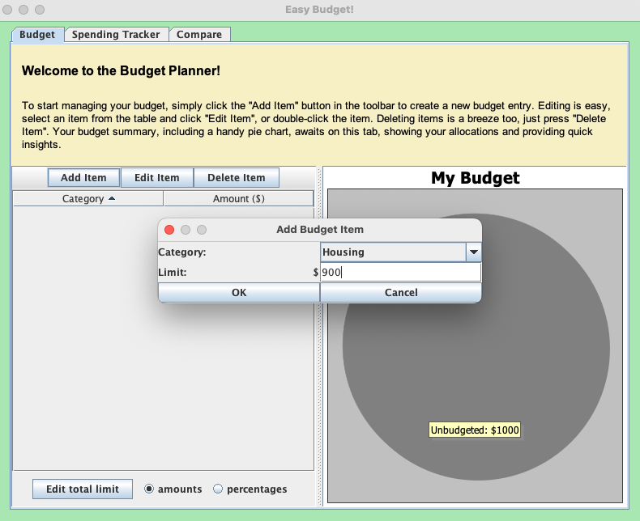

To edit a budget item, go to the Budget tab, select the item in the table, and click the "Edit Item" button in the toolbar, or double-click the item. In a new dialog, set the new spending limit of the category, and click "OK".

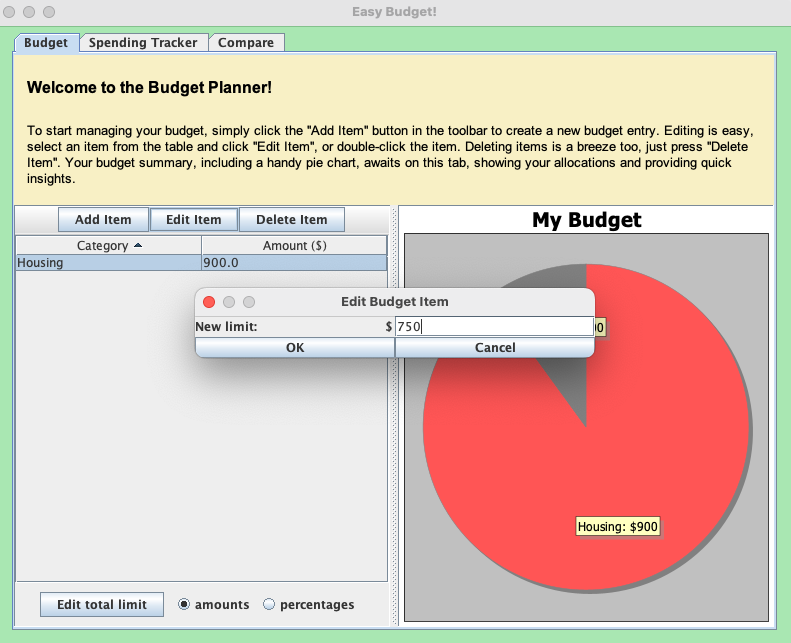

To delete a budget item, go to the Budget tab, select the item in the table, and click the "Delete Item" button in the toolbar.

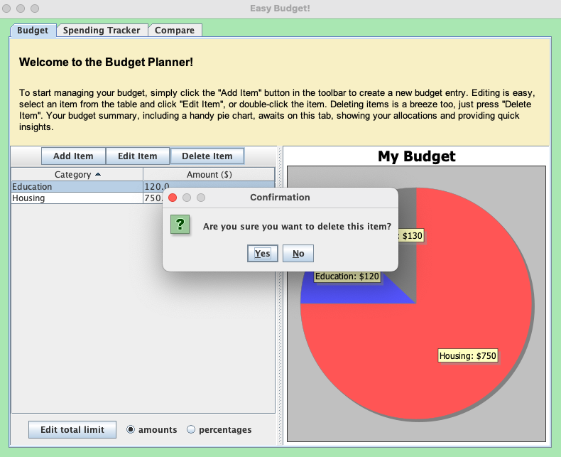

To add an expense to your spending tracker, go to the Spending Tracker tab and click the "Add Expense" button in the toolbar. In a new window, enter all information about the expense, and click "OK".

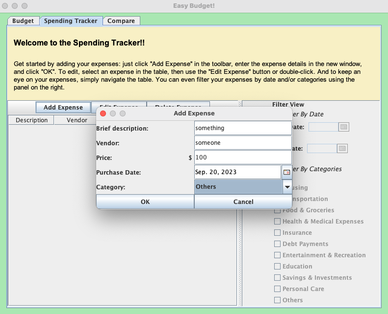

To edit an expense, go to the Spending Tracker tab, select the expense in the tab, and click the "Edit Expense" button in the toolbar, or double-click the item. In a new dialog, change any details of the expense you want, and click "OK".

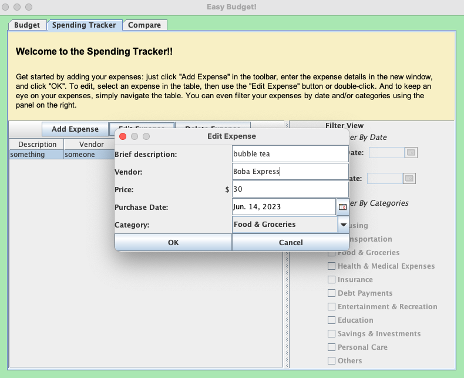

To view your budget, go to the Budget tab, where you will see a table of your budget items, as well as a pie chart showing how much is allocated to each category. You can switch between viewing limits of each category in the pie chart as amounts or percentages at the bottom of the tab.

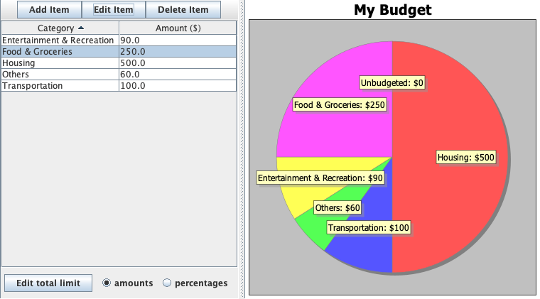

To view your expense tracker, go to the Spending Tracker tab where you will see a table listen your expenses.

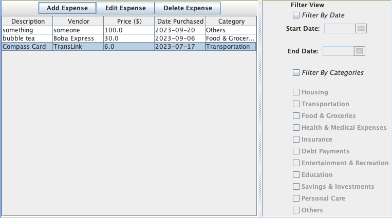

To filter your view of expenses by category/date, use the Filter View panel in the Spending Tracker tab.

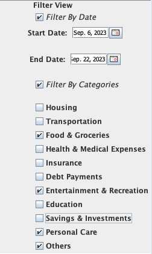

To compare your month's expenses with your budget, go to the Compare Tab where you can view a simple comparison table.

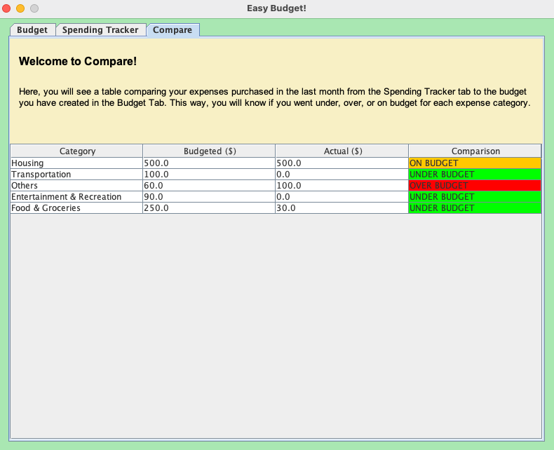

You can save the state of this application in a separate dialog once you exit the GUI.

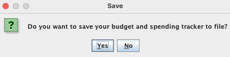

You can reload the state of this application in a separate dialog once you start the GUI.

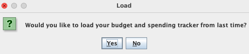

## Phase 4: Task 2

```text
Mon Aug 07 19:20:50 PDT 2023
Total limit of budget set to $1200.00

Mon Aug 07 19:21:06 PDT 2023
Budget item with category 'Housing' and limit $450.00 added to budget

Mon Aug 07 19:21:11 PDT 2023
Edited limit of budget item with category 'Housing' to $500.00

Mon Aug 07 19:21:16 PDT 2023
Item with category 'Housing' and limit $500.00 deleted from budget

Mon Aug 07 19:21:28 PDT 2023
Expense 'something' from someone purchased for $100.00 on Thu Aug 03 2023 with category 'Others' added to spending tracker

Mon Aug 07 19:21:34 PDT 2023
Description of expense purchased for $100.00 from someone on Thu Aug 03 2023 with category 'Others' in spending tracker set to 'groceries'

Mon Aug 07 19:21:39 PDT 2023
Vendor of expense 'groceries' purchased for $100.00 on Thu Aug 03 2023 with category 'Others' in spending tracker set to safeway

Mon Aug 07 19:21:43 PDT 2023
Price of expense 'groceries' from safeway purchased on Thu Aug 03 2023 with category 'Others' in spending tracker set to $300.00

Mon Aug 07 19:21:48 PDT 2023
Purchase date of expense 'groceries' purchased for $300.00 from safeway with category 'Others' in spending tracker set to Tue Aug 01 2023

Mon Aug 07 19:21:52 PDT 2023
Category of expense 'groceries' purchased for $300.00 from safeway on Tue Aug 01 2023' in spending tracker set to 'Food & Groceries'

Mon Aug 07 19:21:54 PDT 2023
Expense 'groceries' from safeway purchased for $300.00 on Tue Aug 01 2023 with category 'Food & Groceries' deleted from spending tracker
```

## Phase 4: Task 3
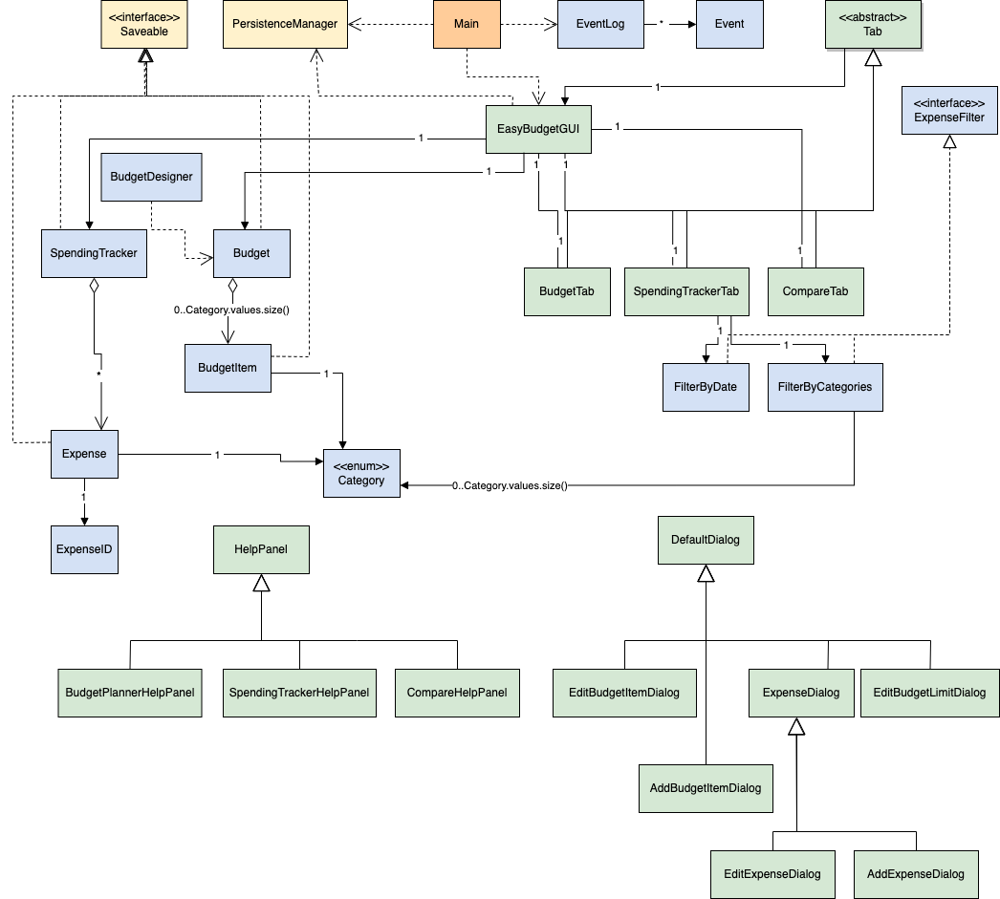

Note that not all dependencies are included in this diagram, just the most important ones.

If I had more time to refactor, I would:
- reduce coupling between ui (colored in green) and the model (colored in blue) classes by implementing the Observer design pattern, where EasyBudgetGUI is the observer and model classes are the subjects
- develop a reusable design to be used in all views in this UI, keeping the functionality consistent
- create a BudgetItemDialog super class that extends DefaultDialog, which AddBudgetItemDialog and EditBudgetItemDialog extend, allowing for more budget-item-related dialogs to be created without repetition of code
- make Budget and SpendingTracker singleton, since there is only one of each of them in the whole GUI
